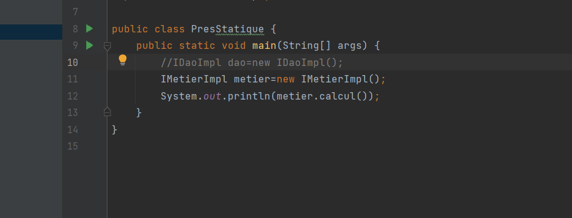
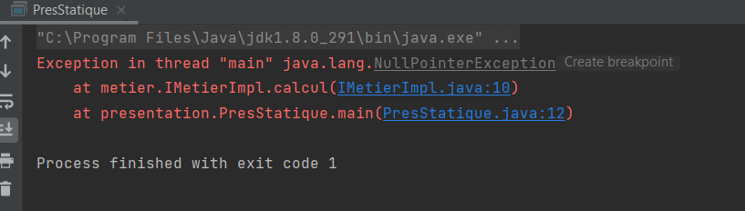
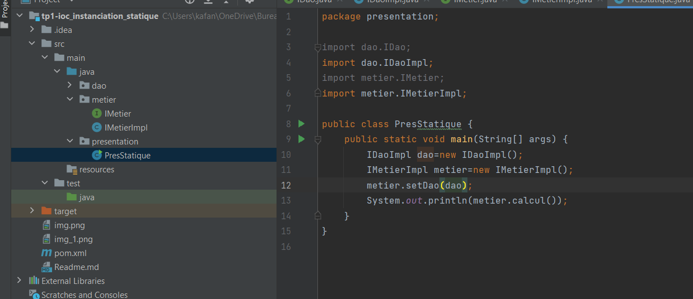
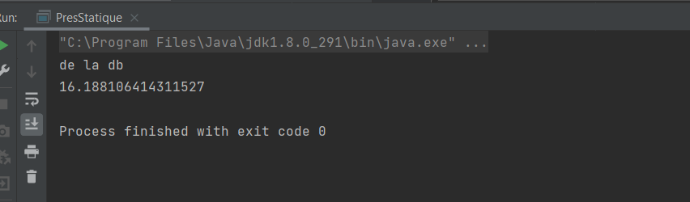
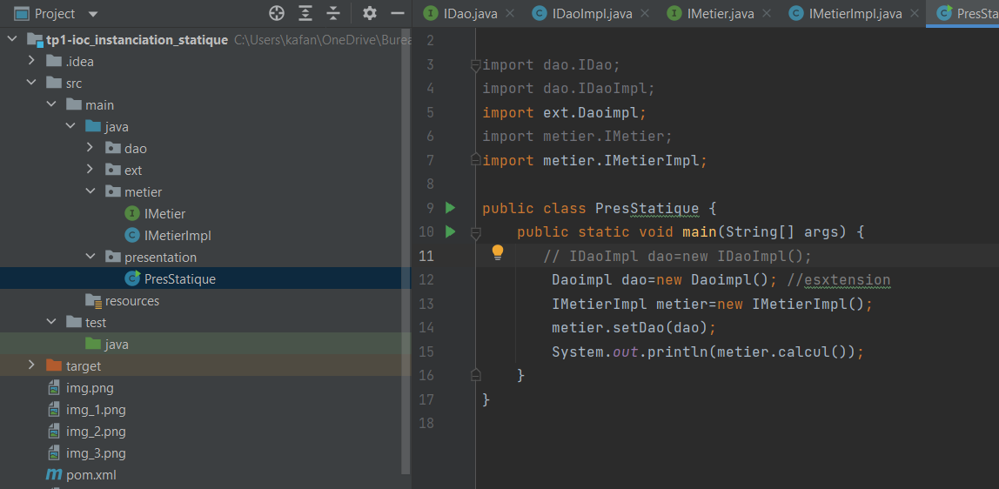
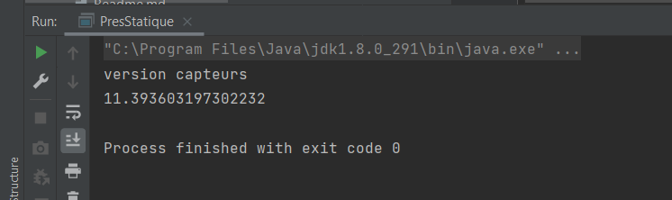

                   Rapport Injection des dependances par instantiation statiqe

Le but final est de faire une application fermer à la modification et ouvert à l'extension .
Pour cela j'ai utilisé des interfaces avec le principe du couplage faible. Ainsi pour ameliorer le code, il suffit de créer une nouvelle implementation de 
de l'interface.
Comment injecter la bonne dependances après l'ajout d'une nouvelle implementation ?

Injection par instanciation statique

si on associe une valeur à l'atribut dao de metier on NullPounterException

Resultat

instanciation statique

Extension (modification de la couche presentation)

la couche dao et metier est fermer à la modification et ouvert à l'extension mais ce n'est pas le cas de 
la couche presentation qui doit etre modifier pour l'injection des dépendances.

