            **Activité Pratique Spring MVC, Spring Data JPA, Spring Security**

//

           ** Couche dao**

Entité Etudiant

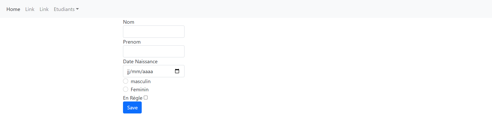

Etudiant Repository

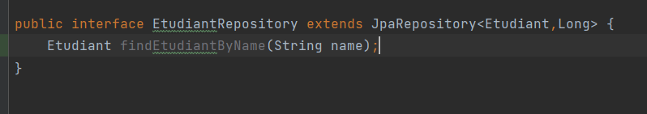

Fichier de configuration

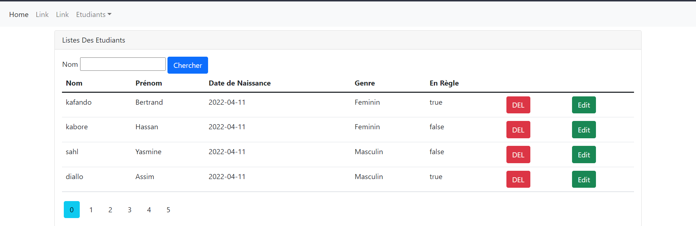

Test et création de bd

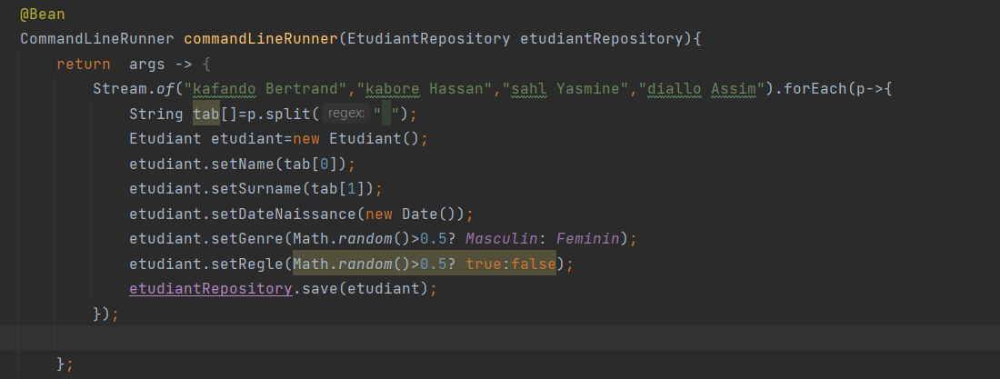

        **Couche web**

EtudiantController

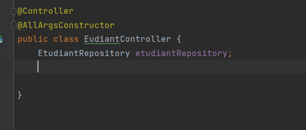

Création d'un template de base pour l'affichage

    Ici nous allons utiliser le moteur de template Thymleaf pour le rendu,après avoir ajouté les dependances dans pom.xml
    j'ajoute les namespace thymeleaf et thymeleaf/layout. j'intègre aussi bootstrap

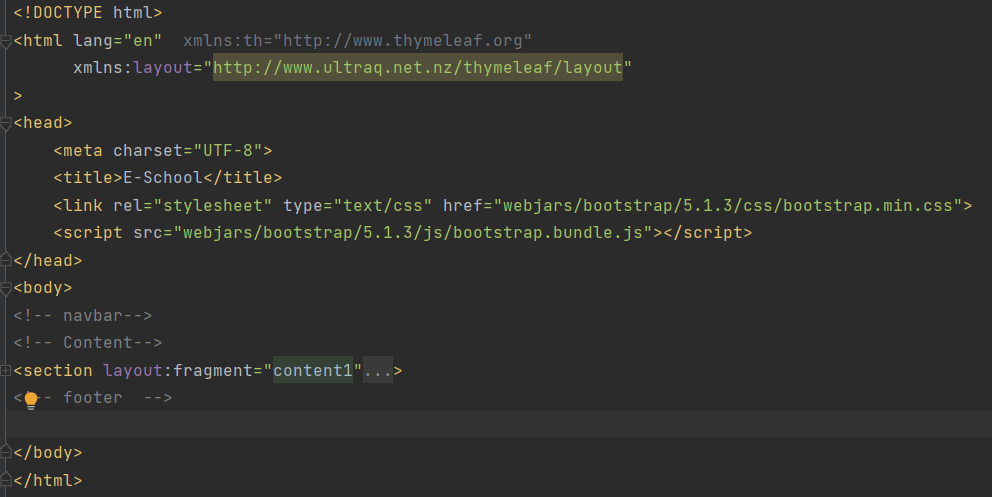

Créeation d'un template

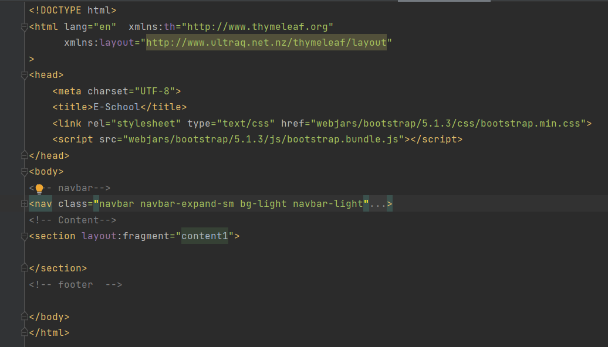
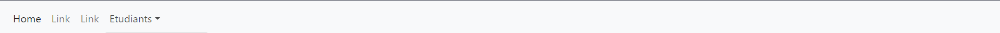

        **Fonctionnalités**
// 

    Affichage des etudiants

Controller :il retourne la vue "etudiants" 

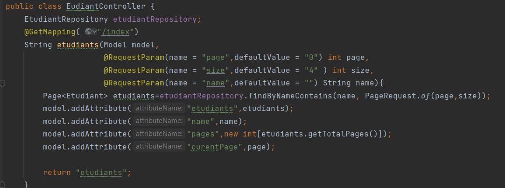

Vue Etudiants avec Thymeleaf avec la pagination

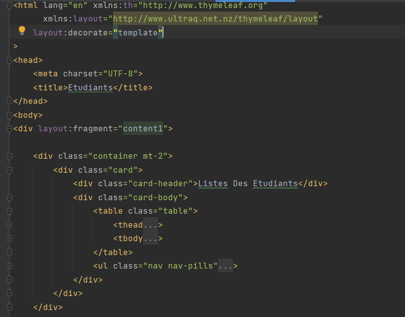

Resultat:

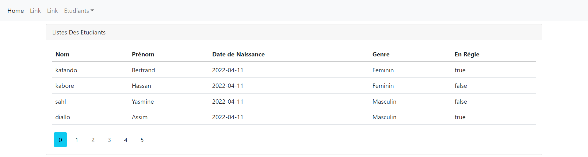

    ** Formulaire de recherche**

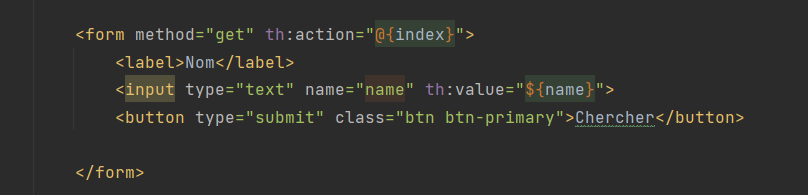
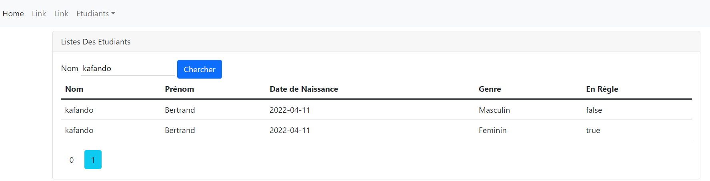

        **supprimer**

        **ajouter**

