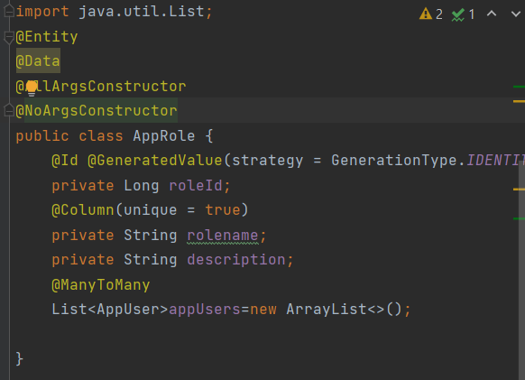
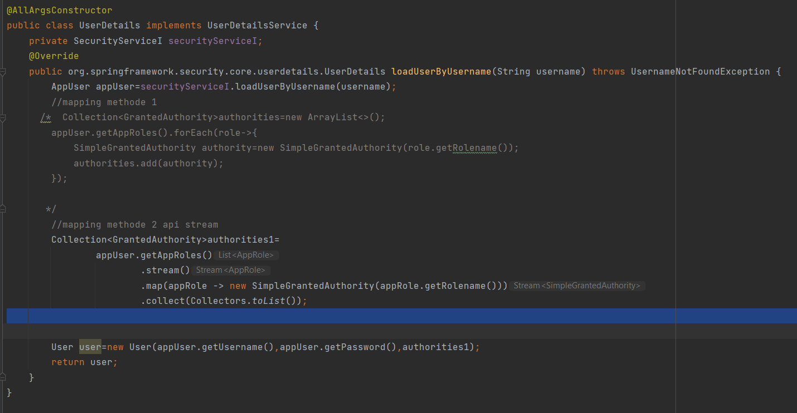

                        **Rapport JEE  Spring MVC avec rendu coté serveur avec Thymeleaf**
                                operations CRUD et Springsecurity
                                    
                                        Partie I:CRUD
    **Creation d'entité**
Entité Patient

    **Repository**

    **Test de l'application**
    association d'une base de données mysql
fichier application.properties

Test de save() et find...()

                                     **Partie Web**

    il faut une classe Controller qui contiendra les différentes actions souhaitées.Ces actions sont appélées par le
    servlet lors d'une requetes http. 
    Ces méthodes appel la couche metier pour les actions et stocke les informations dans le model fournit par srping mvc
    et renvoie le nom de vue et le model au Dipatcherservlet fournit pas spring MVC si le rendu est du coté serveur ou
    du json si le rendu est du coté client.Pour cette  activité nous utiliserons thymeleaf comme moteur de rendu pour
    le rendu coté serveur.Le dipatcherServlet fait appel à la vue et lui transmet la vue qui génère le html à partie des
    données du model.

    Le controller est une classe avec l'annotation @Controller

PatientController

                        **Vue**
    Avant de passer au actions et leur vue créons une page layout qui contient les éléments communs des pages 

Ajout du dependances thymeleaf layout dialect

Creation de fichier html avec les namespaces

                                                            
                                                       **Operation Read**

    =>Retounons la liste des patients. Ici nous allons utiliser la pagination. Pour cela on retourne Page et non une liste.
    =>Ajoutons un formulaire pour permettre de faire une recherche à partir de Keyword .Pour cela il faut creer un methode
    le repositories 

  

action dans le controller

    Pour recuperer les paramètres dans le controller on utilise l'annotation @RequestParam devant les paramètres.
    => pour recuperer les données le controller appel find.. de patientRepository. Ensuite on enregistre ces données
    dans le model avec addAttribute(). et on retourn le nom de la vue.
    =>Pour preciser l'urle de l'action on utilise l'annotation @GetMapping(path="...")

Vue de patients

    =>1-on ajoute le namespace de tymeleaf 
    =>2-Pour utiliser le layout, on ajoute les namespaces et on écrit le code de la page dans un div ayant l'attribut 
    layout:fragment="fragment conncerné"

    =>on va recuperer les données du model et les afficher dans un tableau ici grace à boostrap
    =>liste de patients

    =>formulaire de recherche
    on cree un input avec le name keyword et le button submit. Au clique on appel index avec le keyword dans le lien htttp

    
    Resultat:

    =>pagination
    Grace à la liste des pages recuperer, pour chaque page on crée un lien .Au clique on appel index. ici on precise 
    on envoie la page avec status .index, la taille size et le keyword.preciser le keyword permet de naviguer dans une 
    recherche. Avec th:class on definit la classe du lien en fonction de la page cliquer

    resultat:

                                                       **Operation Delete**

    Ajoutons une colonne contenant lien del dans le tableau.À l'appel on va appeler une action delete du controler qui appel la methode 
    deleteById de patientRepository. En plus du Id on va transmettre le numero de la page courante et le keyword pour 
    faire une redirection vers la meme page.
Vue

methode delete(...)

Test:

    117 est supprimé et on reste sur la meme page

                    
                                                  **Operation Post**

                                                    **Operation Update**

