                        **Rapport JEE  Spring MVC avec rendu coté serveur avec Thymeleaf**
                                operations CRUD et Springsecurity

//

                                        Partie I:CRUD

//

    **Creation d'entité**
Entité Patient
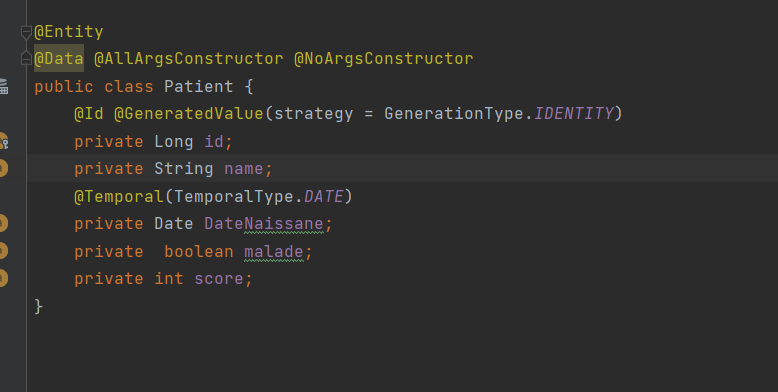

    **Repository**
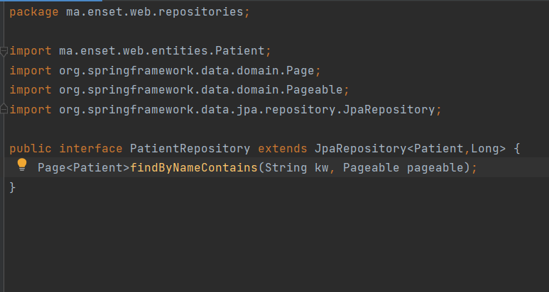

    **Test de l'application**
    association d'une base de données mysql
fichier application.properties

Test de save() et find...()

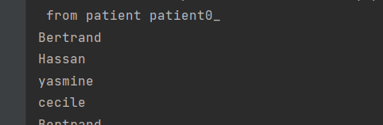

                                     **Partie Web**

//

    il faut une classe Controller qui contiendra les différentes actions souhaitées.Ces actions sont appélées par le
    servlet lors d'une requetes http. 
    Ces méthodes appel la couche metier pour les actions et stocke les informations dans le model fournit par srping mvc
    et renvoie le nom de vue et le model au Dipatcherservlet fournit pas spring MVC si le rendu est du coté serveur ou
    du json si le rendu est du coté client.Pour cette  activité nous utiliserons thymeleaf comme moteur de rendu pour
    le rendu coté serveur.Le dipatcherServlet fait appel à la vue et lui transmet la vue qui génère le html à partie des
    données du model.

    Le controller est une classe avec l'annotation @Controller

PatientController

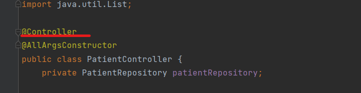

                        **Vue**
    Avant de passer au actions et leur vue créons une page layout qui contient les éléments communs des pages 

Ajout du dependances thymeleaf layout dialect

Creation de fichier html avec les namespaces

                                                            
                                                       **Operation Read**

    =>Retounons la liste des patients. Ici nous allons utiliser la pagination. Pour cela on retourne Page et non une liste.
    =>Ajoutons un formulaire pour permettre de faire une recherche à partir de Keyword .Pour cela il faut creer un methode
    le repositories 
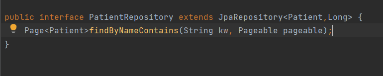

  

action dans le controller

    Pour recuperer les paramètres dans le controller on utilise l'annotation @RequestParam devant les paramètres.
    => pour recuperer les données le controller appel find.. de patientRepository. Ensuite on enregistre ces données
    dans le model avec addAttribute(). et on retourn le nom de la vue.
    =>Pour preciser l'urle de l'action on utilise l'annotation @GetMapping(path="...")

Vue de patients

    =>1-on ajoute le namespace de tymeleaf 
    =>2-Pour utiliser le layout, on ajoute les namespaces et on écrit le code de la page dans un div ayant l'attribut 
    layout:fragment="fragment conncerné"

    =>on va recuperer les données du model et les afficher dans un tableau ici grace à boostrap
    =>liste de patients

    =>formulaire de recherche
    on cree un input avec le name keyword et le button submit. Au clique on appel index avec le keyword dans le lien htttp

    
    Resultat:

    =>pagination
    Grace à la liste des pages recuperer, pour chaque page on crée un lien .Au clique on appel index. ici on precise 
    on envoie la page avec status .index, la taille size et le keyword.preciser le keyword permet de naviguer dans une 
    recherche. Avec th:class on definit la classe du lien en fonction de la page cliquer

    resultat:

                                                       **Operation Delete**

    Ajoutons une colonne contenant lien del dans le tableau.À l'appel on va appeler une action delete du controler qui appel la methode 
    deleteById de patientRepository. En plus du Id on va transmettre le numero de la page courante et le keyword pour 
    faire une redirection vers la meme page.
Vue

methode delete(...)

Test:

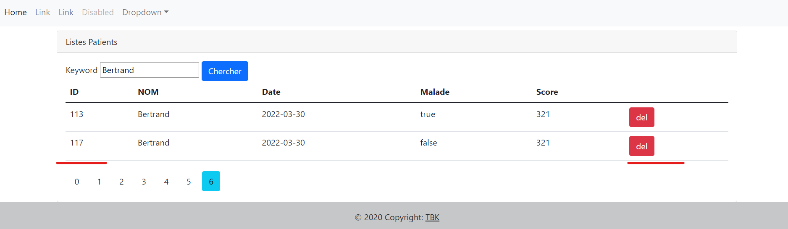

    117 est supprimé et on reste sur la meme page

                    
                                                  **Operation Post**

    
    Creation de de lien pour l'ajout dans le menu
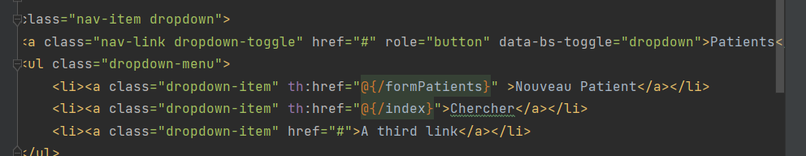

Controller

    on cree un nouveau patient que l'on stocke dans le model et on retourne la vue

    
    =>Dans la vue on cree un formulaire contenant un label un input et le span pour le message d'erreur
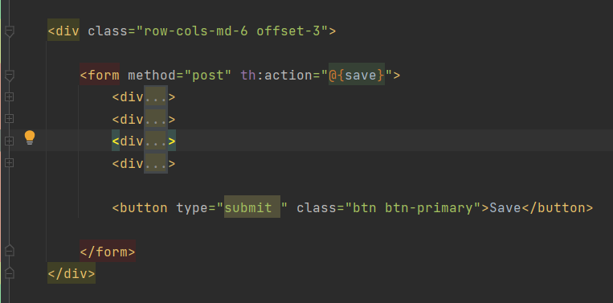

    => la method est de type post et appel l'action save du controller
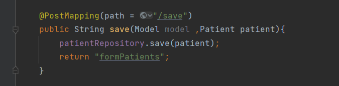

Validation du formulaire:
    
    1- il faut ajouter la dependance spring-boot-starter-validation qui offre des annotations pour la validation
    2-annotations
    @NotEmpty -->no vide
    @DecimalMin("")-->infereir à ..
    @Size(min=, max=)-->taille de string
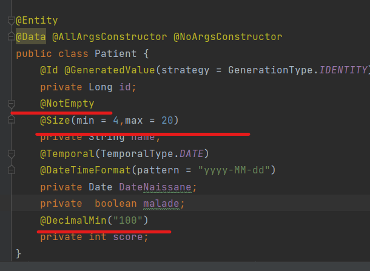

    3-En plus dans le controller , on ajoute un argument BindingResult  dans la methode save.il utilisé pour le test 

    
    4-ajouter span avec th:errors dans le template
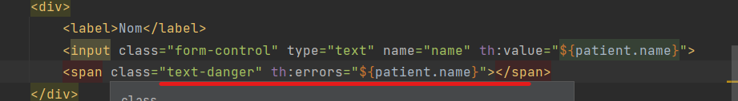

Test:
Non valide

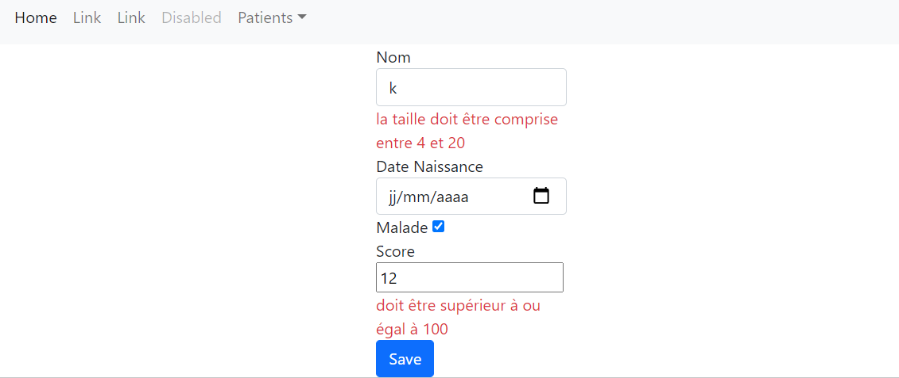

valide

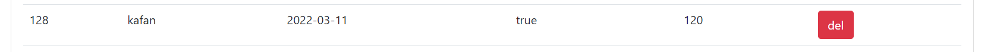

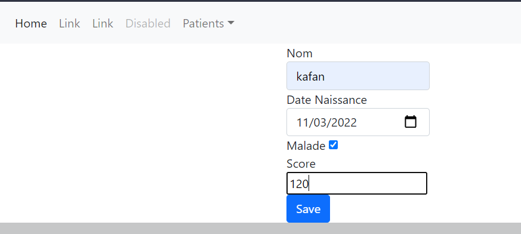

                                                    **Operation Update**
Affichage
    
    ajoute d'un lien edit pour chaqur peoduit
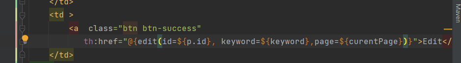

    edit appel l'action edit du controller qui recupère le patient à editer 
    et renvoie la vue edit.hmtl
    j'envoie le keyword et la page pour retouver ma page courante
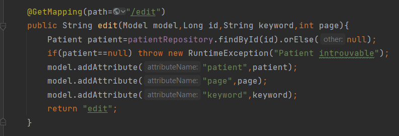
    
    save appel /save du controller qui modifie et retourne la page courante 
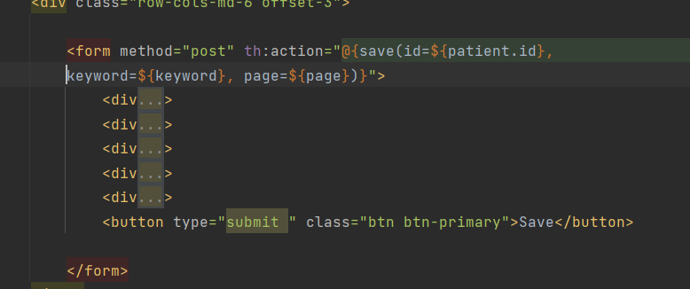

Test:

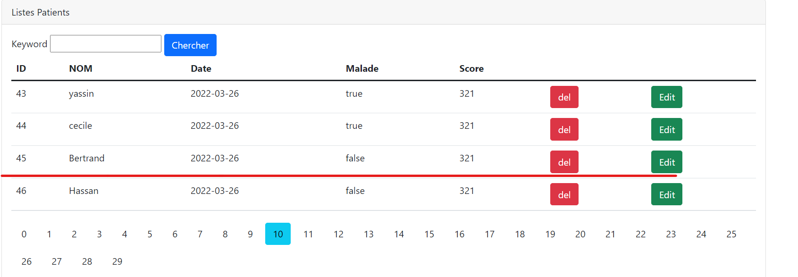
    
    changer le nom
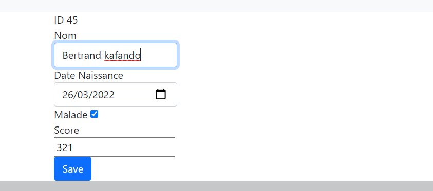

    resultat:
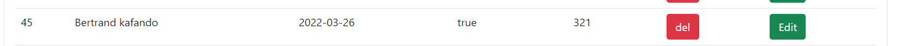

                                    

                                     **Partie II:Spring Security**

//

    Pour utiliser Spring security il faut ajouter la depandances
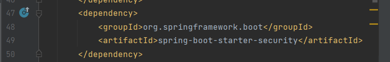

    Quand on demarre l'application, l'authentification est demmandé.Spring demmare un filtre avant la servlet.
    
    Creons notre propre configuration; il faut creer une classe qui herite WebSecurityConfigurerAdapter. Au dessus de la 
    on ajoute @Configuration pour specifier que c'est un fichier de configuration, @EnableWebSecurity pour dire à spring
    d'activer la securité web. 
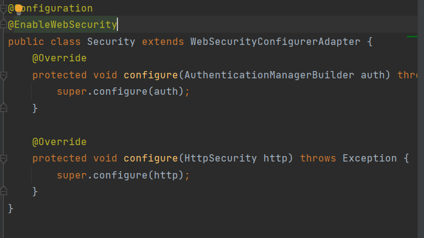

//

            **Authentification avec Spring Security**

    Pour l'authentification il y'a tois choix pour la gestion des utilisateurs du login:in memory, utiliser une base 
    de données de users ou utiliser un annuaire de l'entreprise
//

    Cas 1: In memory
//

    =>il faut redefinir la fonction configure avec l'argument de type AuthentificationManagerBuilder . avec ce parametre 
    on definit nos users avec leur roles.
    Le mot de passe dans la base est encodé; pour cela il faut indiquer un algorithme de codage pour encoder le mot de 
    passe à la declaration ou utilise << {noop}>> avant mot de passe.
    Ici, je vais utiliser BCrypt
    =>on redfinit la methode config avec l'argument HttpSecurity qui permet de definir le formulaire et gére les droits d'accès
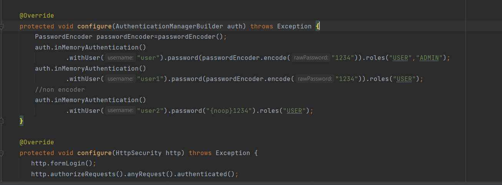
    
    Afficher l'utilisateur;
    Pour utiliser spring security avec thymeleaf il ajouter une dependance
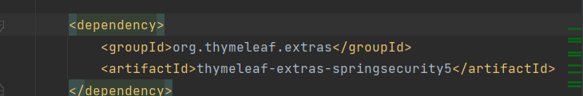

    Ensuite il faut ajouter un namespace dans le fichier html,
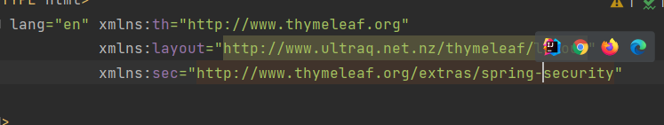
    
    on peut on maintenant afficher le nom.
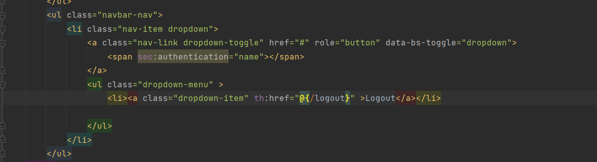

                        Droits d'accès 
//

        Etape:1:Contextualisation -Pour afficher les les fonctionnalités disponible pour les admin on va utilise sec:authorize..
        Ici on prend l'exemple de delete et edit
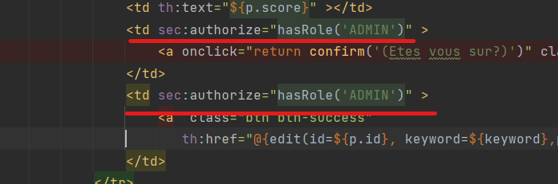

Test:

    on se connecte avec un user admin
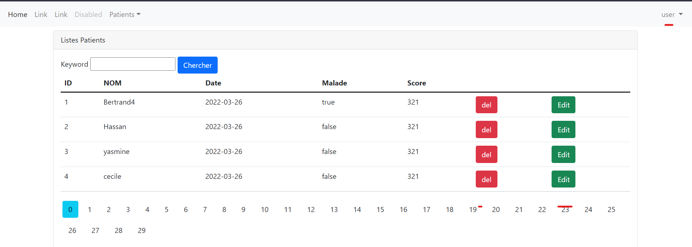

    on se connecte avec user1 qui a le role user seulement
    edit et delete n'apparaissent

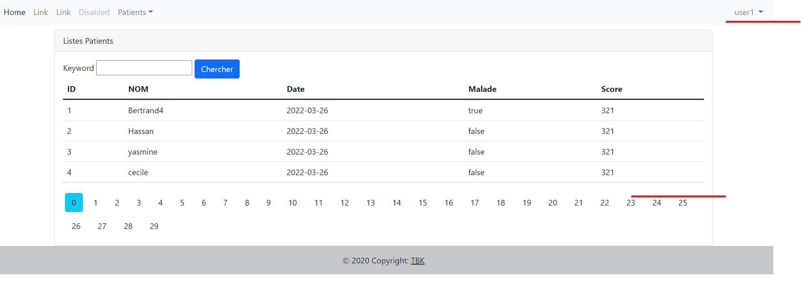

        Etape 2: l'étape 1 permet de gérer l'affichage mais un user peut toujours supprimer en tapant l'url de suppression
    c'est l'escalation.
    Pour rejoudre cela il faut interdire ces requètes aux autres à part les admin.avec   http.authorizeRequests().antMatchers 
    on gère les liens d'accès.
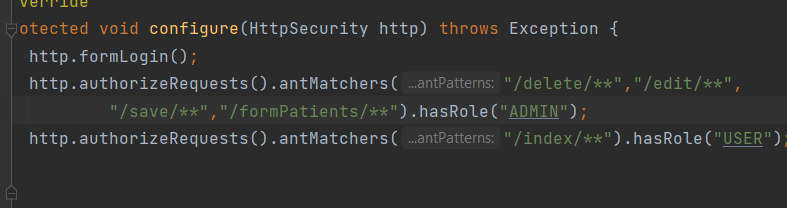

Test:
    
    lorqu'un user essaie d'acceder à un lien admin.on retourne une error 403 .ce qui veut qu'on n'a pas le droit
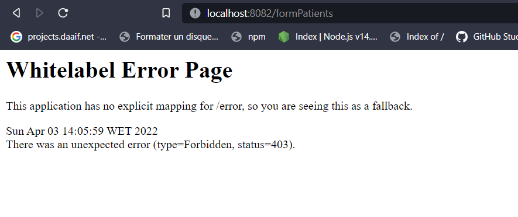

    Personnalisons cette page. on créer notre propre page (403.html), vue + action du controller . et dans le fichier 
    de configuration on gère l'exception en appelant cette page
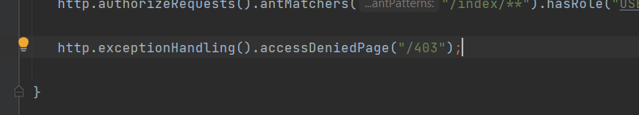

    SecurrityContoller
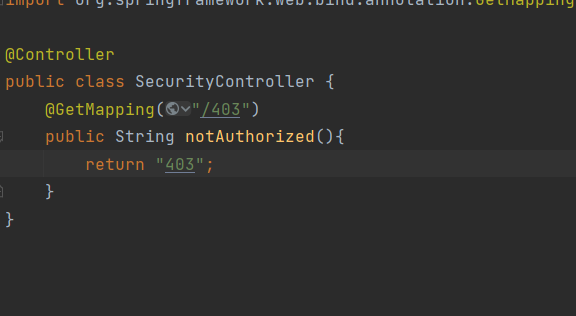

    page 403.html
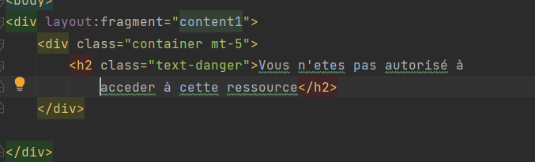

Test:

    si on essaye d'acceder à la page du formulaire
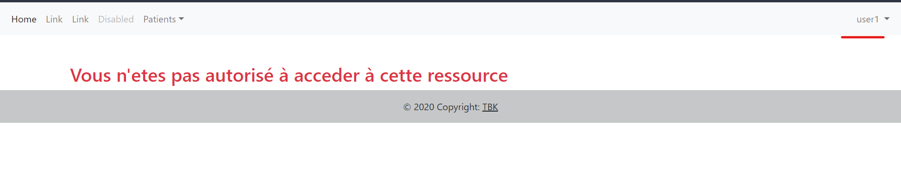

Page sans authentification
    
    Créons une page home vide.Pour faire la page sans authentification
    il faut utiliser "permitAll();" de htttp.authorizeRequests

    
    resultat:
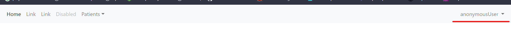

//

    Cas 2: jdbc Authentification

//

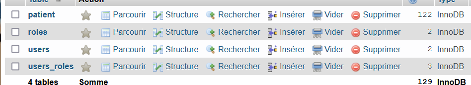

    Dans le fichier de configuration on utilise jdbcauthentification  avec
    dataSource(dataSource)=> on definie la source de données
    .usersByUsernameQuery => on fait la requetes pour recuperer le user
    .authoritiesByUsernameQuery=>on recupère les roles
    .rolePrefix=>
    .passwordEncoder(passwordEncoder)=>on precise l'algorithme d'encodage
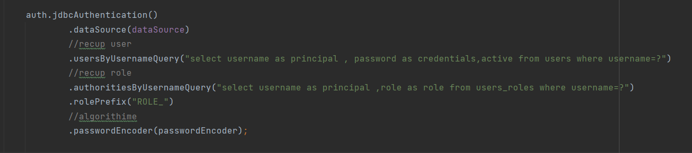

    resultat:
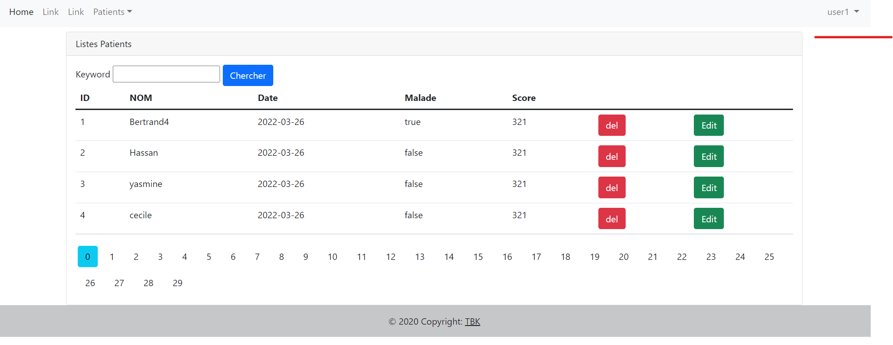

//

    Cas 3: La securité avec UserDetails Service

//
 
    Création de des entités,repositories et service. il est preférable de les separer de l'application
    ici, je les mets dans un  package nommé sec .
Entities

Repositories

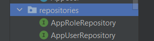

Creation d'une interface de securité

Implementer l'interface UserDetailsService

    Quand le user veut s'authentifier,spring fait appel à la classe qui implemente l'interface UserDetailsService qui 
    redefinie une methode loadUserByUsername qui grâce l'interface de service de  securité qui interragit avec notre couche 
    dao charge le user et ses roles. 
    Les roles sont ensuite mapés en authority et transmi à un objet User de spring avec le username et le password qui
    les retourne.

    
    Dans la méthode reconfigure on appel un objet de la classe qui a implementé Userdetails service

    Avec cette Maniére, il faut utilise hasAuthority au lieu de HasRole pour les droits d'accès
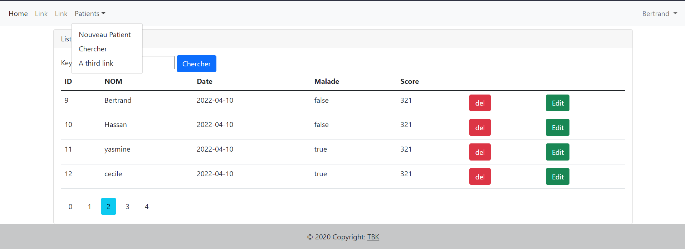