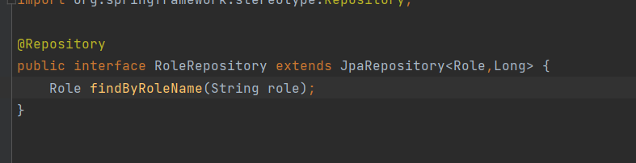

                   **Relation Many To Many**
    Exemple:role et User 
    Pour mapper la relation manyToMany il faut ajouter l'annotation @ManyToMany au dessus des attributs des classes;
    on lui ajoute la propriété mappedBy qui contient le nom d'attribut de l'autre classe.
    Ici mappedBy est placé au-dessus de l'attribut roles de la classe User.    

    Creation d'entité:
User:

Role:

    Création d'interface!

UserRepository:

RoleRepository:

