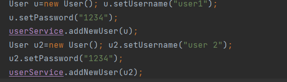

                   **Relation Many To Many**
    Exemple:role et User 
    =>Pour mapper la relation manyToMany il faut ajouter l'annotation @ManyToMany au dessus des attributs des classes;
    on lui ajoute la propriété mappedBy qui contient le nom d'attribut de l'autre classe.
    Ici mappedBy est placé au-dessus de l'attribut roles de la classe User.    
    =>on peut aussi utiliser @JoinTable pour redefinir le nom de la table
    => Le principe pour creer des users avec leurs roles ici est la suivante: il faut creer le User d'abord; creer les 
    les roles et ensuite  associer ces roles au User voulu. soit trois fonctions différentes.

    Creation d'entité:
User:

Role:

    Création d'interface!

UserRepository:

RoleRepository:

    Couche Metier:
    package service
Interface Service

Implementation:

    ->Injection des dependances

    -> .save() pour Ajouter un user

    ->.save() pour ajouter un role

    -> Associer des roles à des users
    la fonction recupère les roles du User et ajoute le ou les nouveaux roles.
    Si on veut faire une relation birectionnel on recupère les utilisateurs du role et on ajoute le User à la liste des
    users du role. c'est pas nécessaire JPA s'en charge

    ->Authentification

        Phase de Test:

Creation de Users

Creation de Roles:

Affecter les roles aux users

Authentification

      Test avec un api Rest
    =>on utilise l'annotation @RestController pour specifier que c'un controler Rest
    =>on fait un injection de dependance avec le constructeur
    =>avec l'annotation @GetMapping() je specifie le chemin
    

