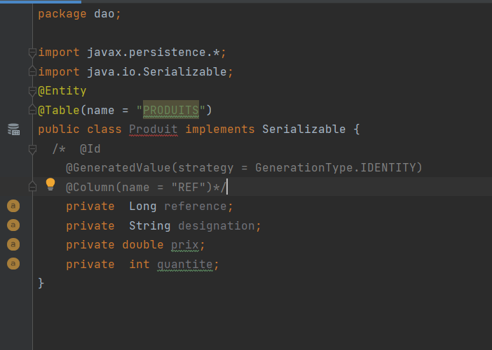
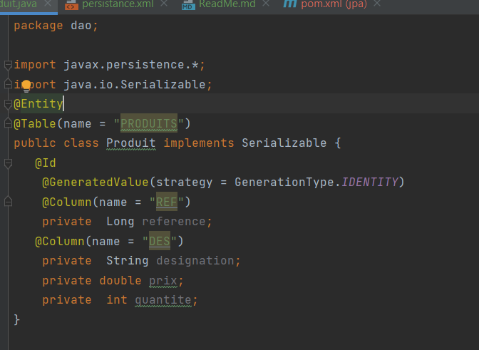

                 **Mapping Object Relationnel avec JPA Java Persistance Api**

Toujours dans la logique d'apprendre les bonnes pratiques de la programmation, nous 
allons faire recourt a un framework qui cette fois s'ocupera de l'ORM au lieu d'utiliser 
le pilote JDBC.
**les avantages sont entre autres:**
gain de temps
protabilité du code dans d'autres SGBD
amelioration de la performance

Nous allons JPA dans cet exemple. JPA est un api dont un ensemble d'interface qui a pour implementation les frameworks de mapping relationnel
comme hibernate.

Pour l'exemple nous travaillerons sur une application qui gère les produits.

**1-** Création d'un projet Maven 

**2-**  Ajout des dépendances dans pon.xml 
hibernate-core,hibernate-entitymanager,hibernate-jpa, mysql-connector-java

**3-** Creation de la classe Produit dans le package dao
Grace aux annotations ...
@Entity==>la classe est entité
@Table ==> considère Produit comme une table

@Id==> reference est declaré comme entier
@GeneratedValue ==> indique que l'entité est autogeneré
@Column==> indique que designation est une colonne de la table

**4-** Construction du fichier persistance.xml

