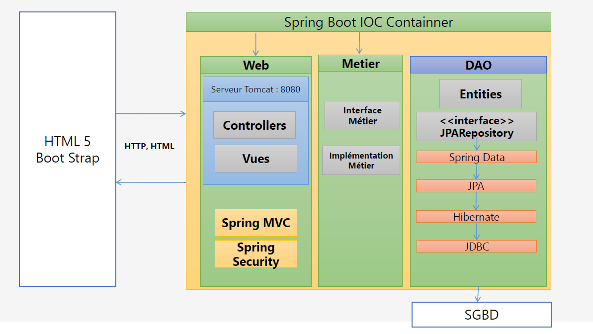
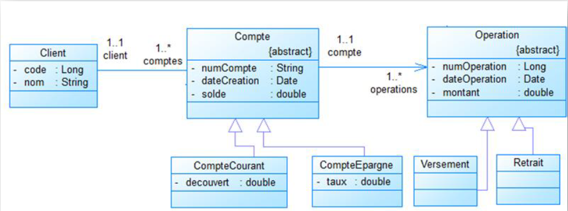

            **  Application **
    On souhaite créer une application qui permet de gérer des
    comptes bancaire.

    Chaque compte est défini un code de type String, un solde et une date de
    création
    Un compte courant est un compte qui possède en plus un découvert
    Un compte épargne est un compte qui possède en plus un taux d’intérêt.
   
    Chaque compte appartient à un client.
     Chaque client est défini par son code et son nom
     Chaque compte peut subir plusieurs opérations.
     Il existe deux types d’opérations : Versement et Retrait
     Une opération est définie par un numéro, une date et un montant.

        **ARCHITECTURE**

    **modlisation**

    **entities
