                **Mapping des associations et de l'heritage JPA SPRING DATA

    creation des entités:
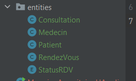  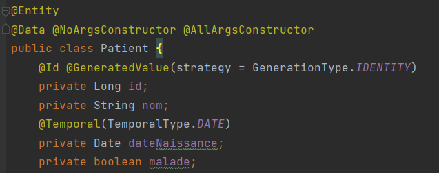  

    Mapping des classes

    **Medecin RendezVous ManyTo One**
    RendezVous a un attribut medecin que j'utilise pour mapper l'association avec la notation @OneToMany 
    j'utilise un type LAZY pour ne pas chargé tous les rendezvous d'un medecin lorque je le charge.
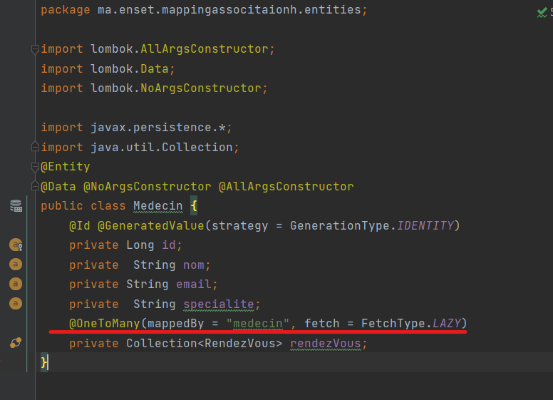

    dans la classe Rendez on ajoute l'annotation @ManyToOne à l'emtité Medecin
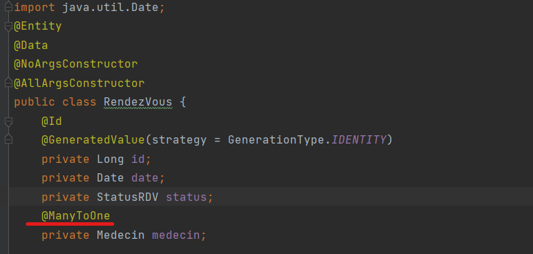

    **Patient RendezVous ManyTo One **
    Dans l'entité RendezVous,au dessus de l'attribut patient , on ajoute l'annotation @ManyToOne pour exprimer la relation
    Dans  l'entité Medecin, au dessus de la collection de rendevous on ajoute l'annotation @OneToMany pou exprimer la relation
    Pour mapper l'association on ajoute à @OneMany les attributs **mappdBy** pour specifier le nom de l'attribut de l'entité en question
    dans l'autre table.et ** fecth type LAZY** pour eviter de charger les rendevous d'un patient lorsque je charge un patient
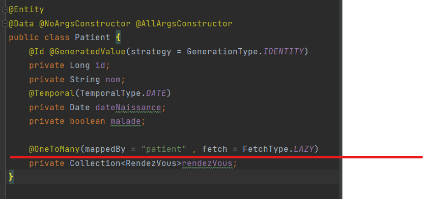
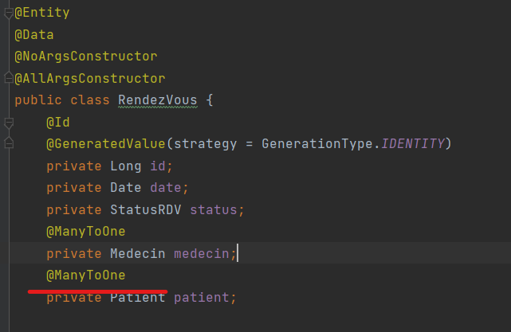

    **Consultation RendezVous OneToOne**
    Pour exprimer l'association on met l'annotation @OneToOne au-dessus des attributs entités .
    Pour mapper l'assoction on doit ajouter mappedBy dans l'une des annotations. Le choix de là ou il est placé determine
    la classe qui contiendra la clé étrangère. Il suffit de raisonner qui doit etre créer avant l'autre pour savoir là ou
    le placer.
    Ici, pour qu'un consultation aie lieu il faut d'abord prendre un rendezvous donc nous allons le placer au dessus de 
    au dessus de l'attribut consultation de la classe Rendez vous.Consultation aura la clé étrangère.
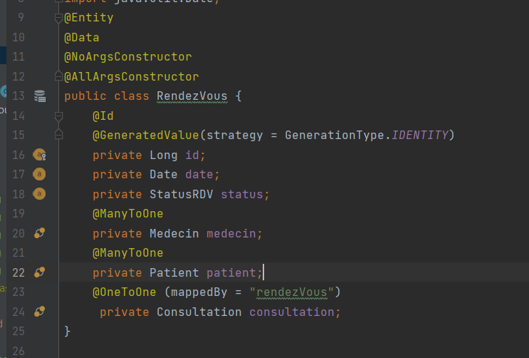

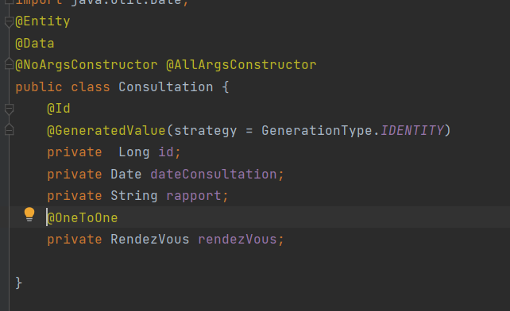

        **Creation d'un application**

    Creation des repositories pour chaque entité
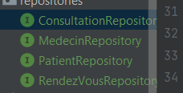
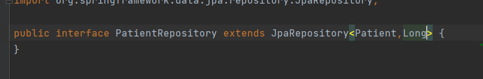

    Test: creation d'une méthode qui retoune CommandLineRunner avec une annotation @Bean
    @Bean--> excution au demarrage qui va retourne  un object 

    **Creation de patient**
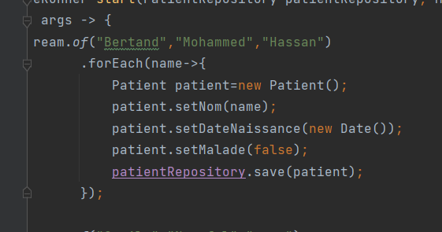
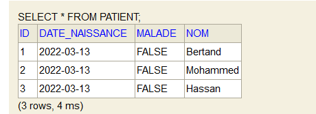

    **Creation de medecin**
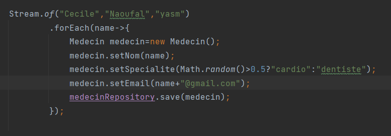
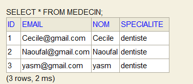

    **Creation de Rendevous**
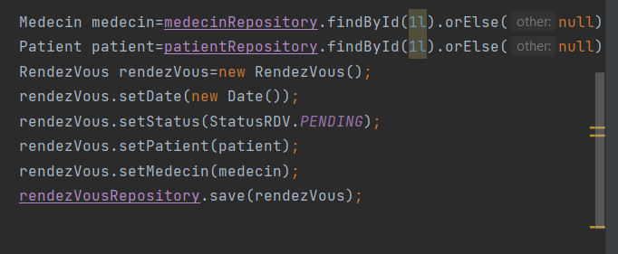
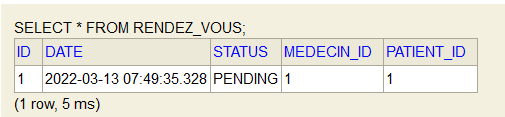

    **Creation de Consultation**
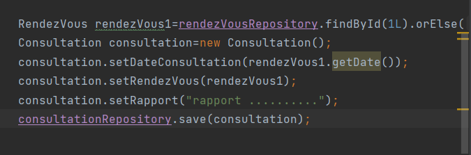
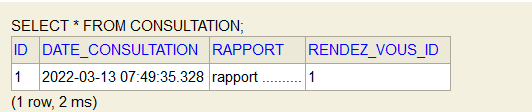

        **Bonne pratique:Creation d'une interface dans le package service offrant le besoin fonctionnel**
    *c'est la couche service qui est utilisé dans le main

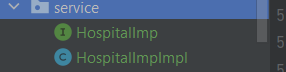

    *utilisation UUID
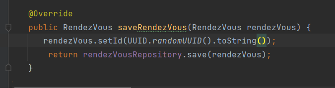
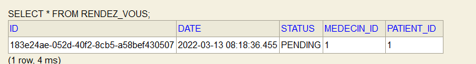