                        Mapping Objet Relationnel avec Spring Data
    * Spring Data est un module de Spring qui a déjà créé des interfaces génériques et des implémentations
    génériques qui permettent de gérer les entités JPA.
    * on appelle plus EntityManager de JPA pour la persistance spring s'en occupe lui meme
    *Il suffit de créer une interface qui hérite de l’interface JPARepository pour hériter toutes les méthodes
    classiques qui permettent de gérer les entités JPA.

     Pour l'exemple, nous ferons une application de gestion de patients

    Creation d'entité:
    POur les getters ,les setters et les je les declare
    grace aux annotations du plugin lambock
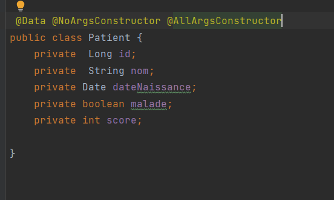

    Creer entité/table avec les annotations de jpa
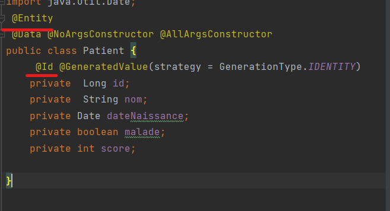

    Generation des entités
    Configuration de application propertie
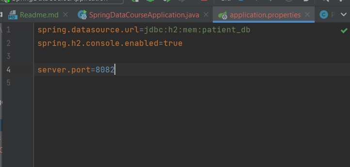

    Excution de l'application SpringDataCourseApplication
    on peut voir la bd sur localhost:8082/h2-console
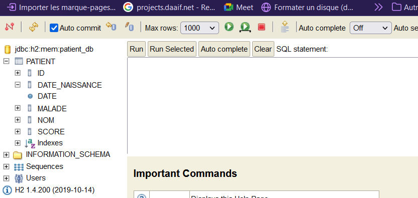

    Operation dans la bd 
    Pour gerer l'entité Patient creons un Jpa repository
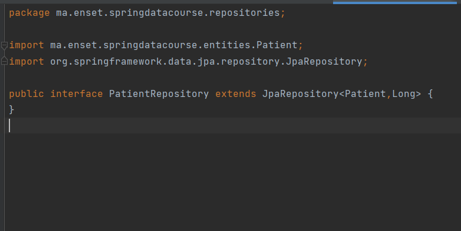
    
    on implemente une interface CommandLineRunner pour les operations  après l'excecution
    et grace à @Autowired on fait l'injection des dependances du PatientRepository

.save() insertion
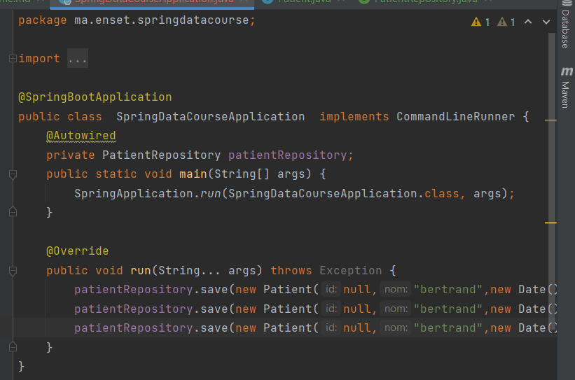

Résultat Excécution:
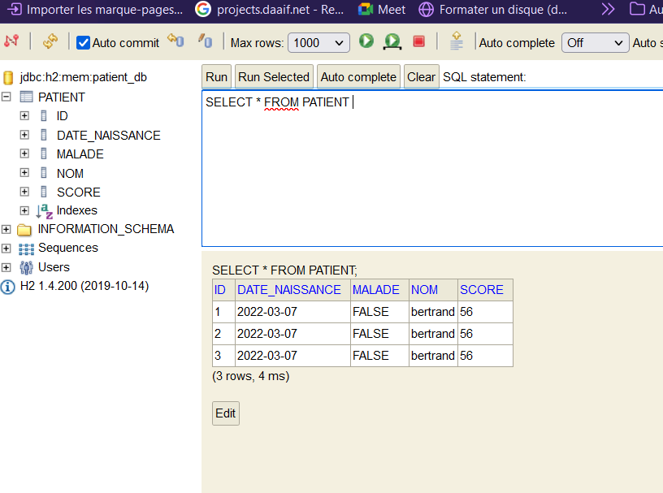

    .findById()
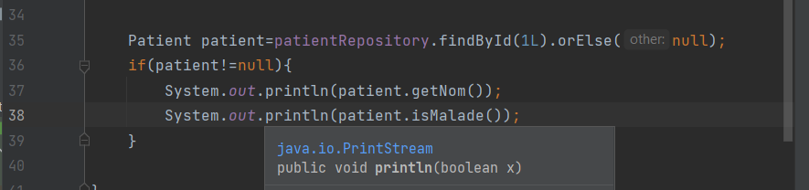

resultat:
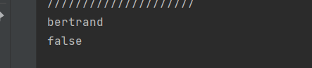

    update avec .save()
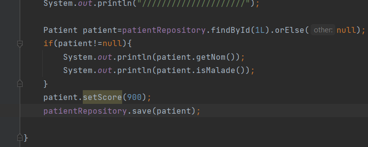

resulat:
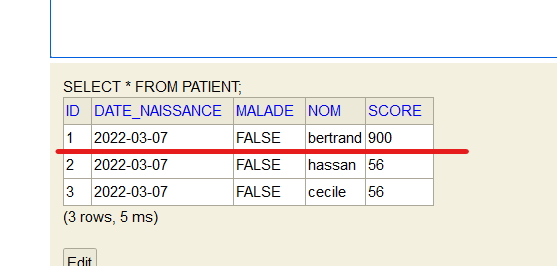

    .deleteById() suppression 
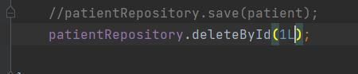

resultat: suppresion de bertrand
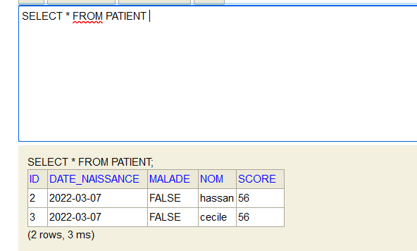

    .findAll()
    Cas 1:on peut recuper sous forme de List de patients
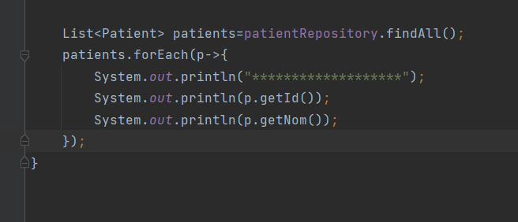

    Cas 2:recuperer sous forme de Page
    Il est utilise lorque le nombre de données est important, on a besion de faire de la pagination
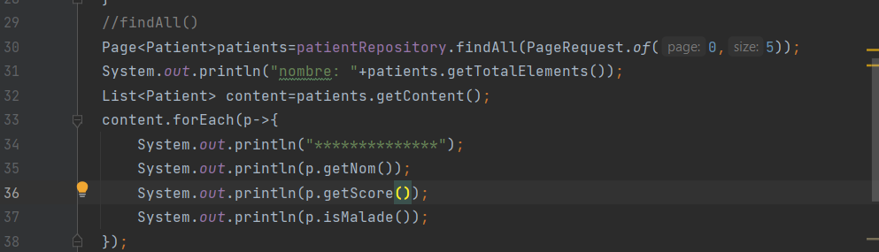

Résultat: Retourne 5 enregistrement
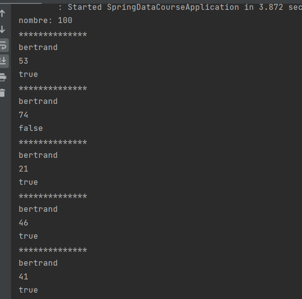

                Nous avons vu les operations de base comment creer  nos propres méthodes
    il suffit d'aller  la declarer  dans l'interface jpa repository

    Cas 1:
    .findByMalade(m) sans pagination
Creation:
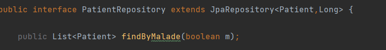

Main:
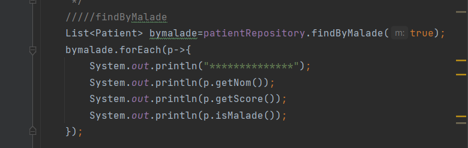

resultat:
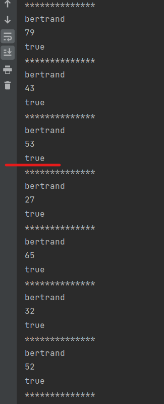

    .findByMalade(m) avec pagination
Creation:
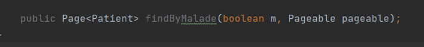

Main:
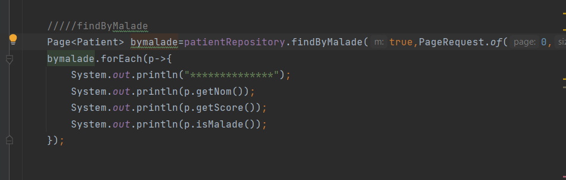 

Resultat: 5 personnes malades
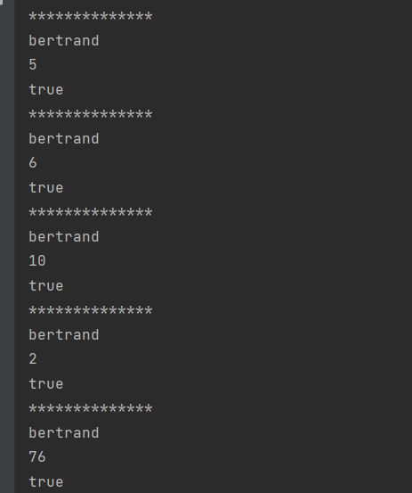

    Cas 2: sql
Creation:

main:
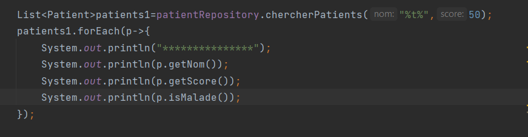

resultat: on va retourner tous les bertrand qui ont un score inferieur à 50
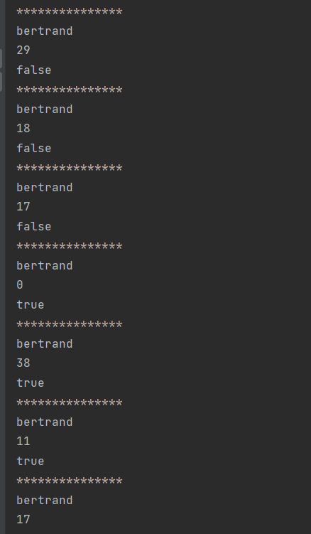

                  Passer à Mysql
    on ajoute la dependances mysql et on modifie application.properties
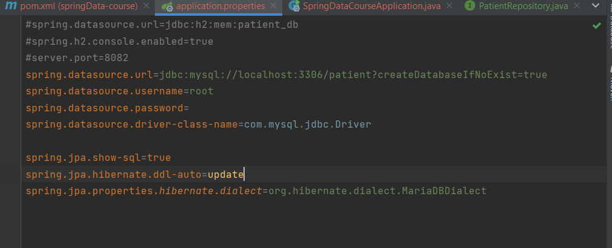
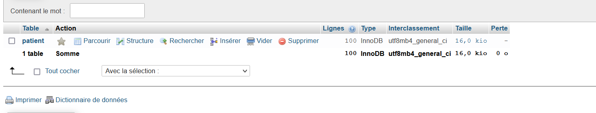