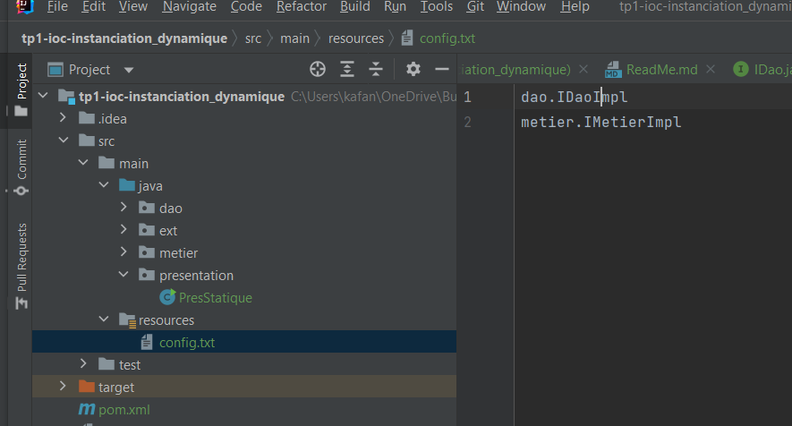
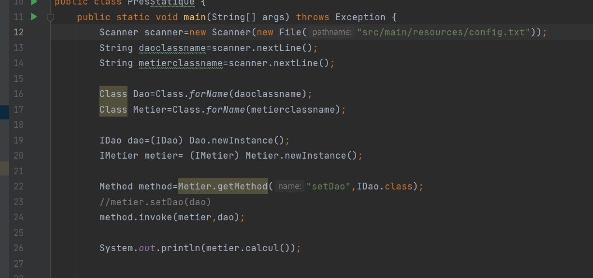
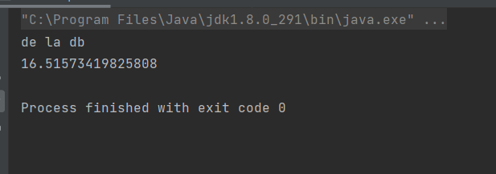
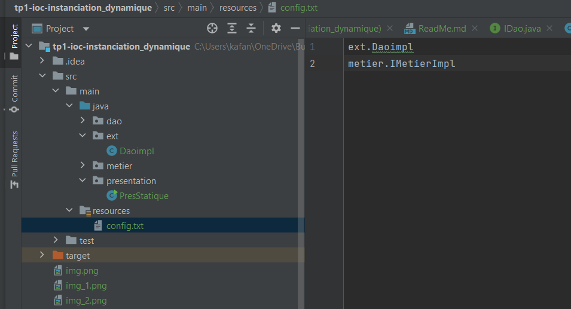
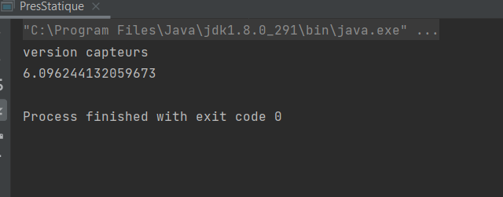

                 Rapport Injection des dependances par instantiation dynamique

Le but final est de faire une application fermer à la modification et ouvert à l'extension .
Pour cela j'ai utilisé des interfaces avec le principe du couplage faible. Ainsi pour ameliorer le code, il suffit de créer une nouvelle implementation de
de l'interface.
Comment injecter la bonne dependances après l'ajout d'une nouvelle implementation ?

Injection par instanciation dynamique

L'instanciation dynamique consiste à creer un fichier de configuration conffig.txt qui va donner les informations sur les dependances à 
utiliser. Il suffit de modifier ce document pour avoir la bonne dependances

ext.Daoimpl

                 

Nous arrivons à faire une application fermée à la modification et ouverte à l'extension
mais cela demmande beaucoup de lignes de code donc du temps  et notre application ne respectent toutes 
les exigences techniques pour le moment.

Pour optimiser le travail il faut se servir de l'expérience des autres en utilisant
le principe d'inversion des controles qui permet au developpeur de laisser le code technique
à un framework pour travailler uinquement sur la couche metier,fonctionnelle.
