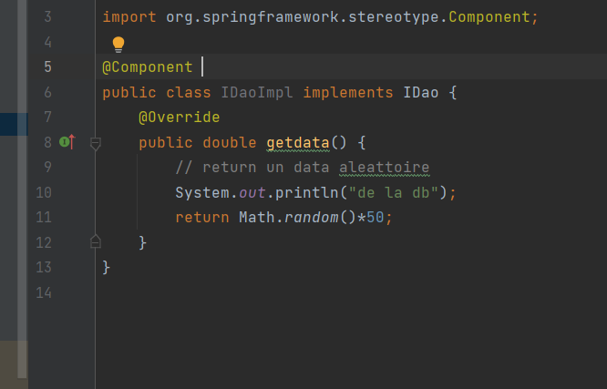
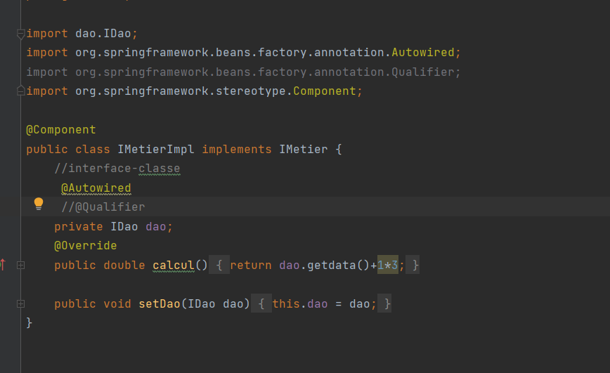
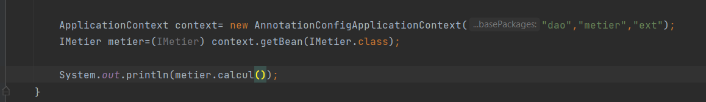

                         Injection des dépendances avec Spring

Utilisation d'un fichier config xml

Cette methode consiste à definir un fichier de configuration grace auquelle Spring va associer les bonnes dependances

Le main devient 

Injection des dependances par Annotation @

la méthode consiste à mettre @component au dessus de la classe à utiliser 
et @autowired devant la variable.

main:

resultat:

on peut aussi nommer les composants dans ce cas on doit utiliser @qualifer pour choisir 
version bd

version capteurs:

IMetierImplementation

Resultat:

Injection des dependances par constructeur

