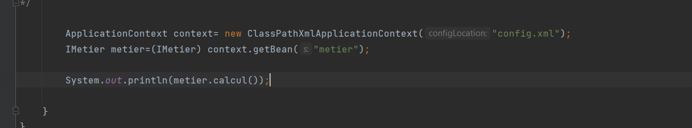
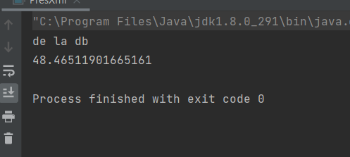

                         **Injection des dépendances avec Spring(core,Context,Beans)**

L'interet d'utiliser un framework est de laisser le code technique  à ce dernier et s'occuper du code metier.
Il y'a principalement 02 manieres: Les annotations er l'utilisation d'un fichier xml

                                 **Utilisation d'un fichier config xml**
Cette methode consiste à definir un fichier de configuration xnl grace auquelle Spring va associer les bonnes dependances
Pour les dependances on peut utiliser un constructeur ou un setter.

    L'utilisation d'un setter: dans le fichier xml on declarer un bean pour chaque classe.pour declarer le setter on utilise la balise 
    poperty.

    Le main devient 

    L'utilisation d'un constructeur: pour le constructeur on utilise la balise constructor-org

    resultat:
    version bd

    version capteurs

                                  **Injection des dependances par Annotation @**

    la méthode consiste à utiliser des annotations pour specifier  au framework quel classe utiliser
 @componnent--> pour designer que les classes doivent implementer

Cas 1: Notation Autowired
    Dans l'implementation de IMetier les annontations peuvent varier
    on utilise @Autowired pour  faire l'injection 

     Dans le main 

resultat:

Lorque qu'il y'a plusieurs implementation ,il faut donner un nom à chaque component .
Dans ce cas on doit utiliser @qualifer("nom du compenet à instancier") pour choisir 
version bd

version capteurs:

IMetierImplementation

Resultat:

Cas 2: Injection des dependances par constructeur 
on garde @component 

on declare le constructeur

Lorsque y'a plusieurs composants , le contructeur choisit le premier qu'il trouve

